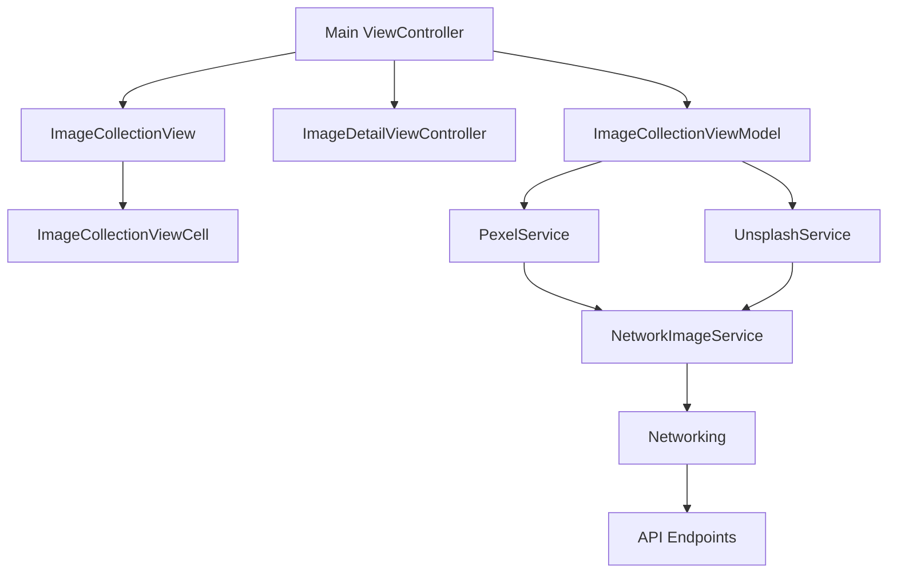

# ImageCollection

ImageCollection is an iOS application developed in Swift, utilizing the UIKit framework. The application serves as a platform for users to search, view, and explore images sourced from both the Unsplash and Pexels APIs. Allowing for flexible extension - via the `NetworkImageService` protocol - to add new services in the future. 

## Core Features

- **Image Search:** Users can search for images using both the Unsplash and Pexels APIs, offering a wide variety of visual content.
- **Image Display:** Images are elegantly displayed in a custom collection view, ensuring a visually appealing and organized layout.
- **Dynamic Cell Sizing:** The application dynamically adjusts the cell size based on the device's orientation and screen size, enhancing the user experience.
- **Detailed Image View:** Users can view detailed information about selected images in a dedicated detail view.
- **Testing:** Comprehensive unit and UI tests are included to ensure the application's functionality and reliability.

## Getting Started

Follow these instructions to get a copy of the project up and running on your local machine for development and testing purposes.

### Prerequisites

Ensure that your system meets the following requirements:

- Xcode 12.0 or later
- iOS 14.0 or later
- Swift 5.0 or later

### Installation

Clone the repository and open the project in Xcode. You can then build and run the project on your preferred simulator or physical device.

## Project Structure

The project is thoughtfully structured into several directories, each serving a specific purpose:

- `App`: Contains AppDelegate and SceneDelegate.
- `Models`: Houses the data models used throughout the application.
- `Services`: Includes services for interacting with both the Unsplash and Pexels APIs.
- `ViewModels`: Contains the view models that provide data for the views.
- `Views`: Comprises the views and their related files, including custom collection views and detail views.
- `Tests`: Contains both unit and UI tests for the application.

## Usage

The application presents a collection view of images, allowing users to search for images using the search bar at the top of the screen. The cells in the collection view dynamically adjust their size based on the device's orientation and screen size.

## Testing

The project includes extensive unit and UI tests. To run the tests, select the desired test suite in Xcode and execute the 'Run' command.

## Contributing

For details on our code of conduct and the process for submitting pull requests, please read the [CONTRIBUTING.md](CONTRIBUTING.md) file.

## License

This project is licensed under the MIT License. For more details, please refer to the [LICENSE.md](LICENSE.md) file.

## Acknowledgments

Special thanks to the Unsplash and Pexels APIs for providing the images used in this application.

## Contact

For any questions, concerns, or suggestions, feel free to open an issue on this repository.

---

**Note:** This README assumes the existence of CONTRIBUTING.md and LICENSE.md files in the repository. If these files do not exist, you may want to create them or adjust the links accordingly.
